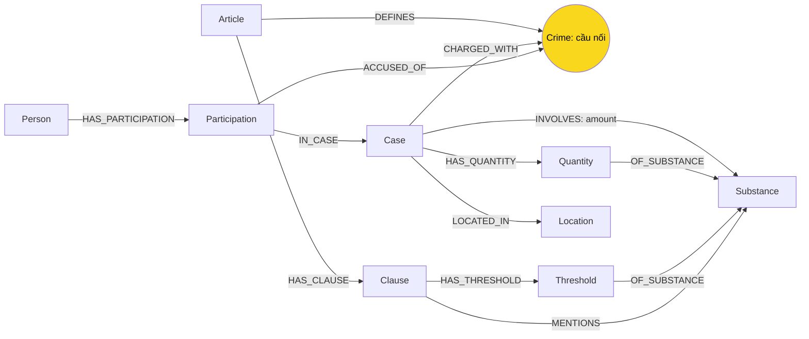

# Thiết kế ontology — Day 19

**Họ tên:** Trương Việt Anh — **MSSV:** 2A202602444

- [ ] Ontology gợi ý
- [x] Tự thiết kế: bằng chứng theo nguồn/người và ngưỡng khối lượng

## 1. Sơ đồ

## 2. Entity types

| Label | Ý nghĩa | Khóa MERGE | Properties | KB / trích xuất |
| --- | --- | --- | --- | --- |
| Article | Điều luật | id | title, law, doc_id | Luật / regex |
| Clause | Khoản | id | number, penalty, text, doc_id | Luật / regex |
| Crime | Tội danh chuẩn dùng chung | name | name | Luật tạo tên; tin qua link_entity |
| Substance | Chất chuẩn dùng chung | name | name | Hai KB / regex, LLM, từ điển đồng nghĩa |
| Case | Mô tả vụ trong một nguồn | doc_id:case:index | name, summary, date, doc_id, source_title, evidence | Tin / LLM |
| Person | Người dùng chung | hash tên đầy đủ chuẩn hóa NFC/casefold/khoảng trắng | name, aliases | Tin / LLM |
| Participation | Khẳng định về người theo nguồn và vụ | hash(case_id, person_id, stage, charge, sentence) | role, stage, charge, sentence, sentence_stage, evidence, doc_id | Tin / LLM, đối chiếu evidence nguyên văn |
| Location | Địa điểm dùng chung | name chuẩn hóa | name | Tin / LLM |
| Quantity | Lượng chất theo nguồn | case_id:quantity:index | amount, value_g, qualifier, evidence, doc_id | Tin / LLM chọn lượng, regex đổi đơn vị |
| Threshold | Ngưỡng tại một điểm luật | clause_id:point:substance | point, min_g, max_g, text, doc_id | Luật / regex |

Mọi node theo nguồn mang doc_id=Document.id. Crime, Substance, Person, Location là thực thể dùng chung; provenance theo tài liệu nằm ở Case, Participation, Quantity, Threshold. Không ghi đè doc_id của người bằng bài báo gần nhất.

## 3. Relationships

| Type | Từ → Đến | Properties | Ý nghĩa |
| --- | --- | --- | --- |
| DEFINES | Article → Crime | Không | Điều định nghĩa tội |
| HAS_CLAUSE | Article → Clause | Không | Cấu trúc luật |
| MENTIONS | Clause → Substance | Không | Khoản nhắc chất |
| HAS_THRESHOLD | Clause → Threshold | Không | Ngưỡng lượng tại điểm |
| OF_SUBSTANCE | Threshold/Quantity → Substance | Không | Ngưỡng/lượng thuộc chất nào |
| CHARGED_WITH | Case → Crime | Không | Tội xuất hiện trong vụ, không gán cho mọi người |
| HAS_PARTICIPATION | Person → Participation | Không | Khẳng định về người |
| IN_CASE | Participation → Case | Không | Nguồn mô tả vụ |
| ACCUSED_OF | Participation → Crime | Không | Tội/hành vi riêng người, chưa mặc định là kết án |
| HAS_QUANTITY | Case → Quantity | Không | Lượng có nguồn |
| INVOLVES | Case → Substance | amount | Đường ngắn tổng hợp vụ theo chất |
| LOCATED_IN | Case → Location | Không | Địa điểm |

## 4. Node cầu nối

Crime là cầu chính: Participation-ACCUSED_OF→Crime←DEFINES-Article. Từ Participation hoặc Case có doc_id tới Article là 2 cạnh, đáp ứng hợp đồng ≤4 cạnh. Substance là cầu bổ sung để nối Quantity với Threshold.

link_entity chuẩn hóa cả hai phía, exact trước rồi difflib cutoff=0.8; trả tên gốc trong danh sách luật, None khi không đủ giống. Tên chất dùng NFC, casefold và từ điển heroin/heroine, ketamin/ketamine, thuốc lắc/MDMA. Không tự coi "kẹo" là MDMA khi nguồn chưa xác nhận.

Cầu gãy khi nguồn không nêu tội hoặc LLM bỏ sót. Giữ charge rỗng, không gán tội chung của vụ cho người. Trích dẫn không nằm trong nguồn gây lỗi rõ để kiểm tra lại, tránh âm thầm mất bài báo.

## 5. Competency questions

| Câu | Đường đi / chiến lược | Khả năng và điều kiện |
| --- | --- | --- |
| Q1 | Vector seed → Article-HAS_CLAUSE→Clause.text của Luật PCMT | Lấy mọi khoản của Điều seed để không bỏ định nghĩa tiền chất; phụ thuộc vector lấy đúng Điều |
| Q2 | Case←IN_CASE-Participation←HAS_PARTICIPATION-Person | sentence và sentence_stage giữ án đúng người nếu extraction đầy đủ |
| Q3 | Person→Participation→Crime←Article→Clause(number=1) | Án theo nguồn, khung cơ bản; không suy án phúc thẩm từ sơ thẩm |
| Q4 | Person.aliases→Participation→Crime←Article→Clause | Câu tối đa lấy tất cả khoản có hình phạt, kể cả khoản không nhắc chất |
| Q5 | Person→Participation→Crime←Article→Clause→Threshold→Substance←Quantity←Case | Đổi kg/g và đối chiếu ngưỡng; không coi đối chiếu là phán quyết của tòa |
| Q6 | Substance(MDMA)←INVOLVES-Case và người trong Case | Tổng hợp toàn graph theo chất, vượt phạm vi top-k; phụ thuộc extraction/max_facts |

## 6. Quyết định thiết kế và đánh đổi

1. Participation riêng theo nguồn/người thay cho property trên một cạnh: giữ charge, stage, sentence_stage và evidence, tránh trộn tội và giai đoạn; tốn thêm node.
2. Quantity và Threshold thay amount dạng chuỗi: query được khối lượng và khoảng [min,max). Regex chỉ hỗ trợ chất hóa học có tên rõ và khối lượng; chưa hỗ trợ hỗn hợp, thể tích, nhựa và thực vật.
3. Case khóa theo tài liệu thay tên LLM: không gộp nhầm vụ khác tên giống nhau; chấp nhận một vụ thực có nhiều Case ở nhiều nguồn. Person dùng tên đầy đủ chuẩn hóa nhưng vẫn có thể nhầm người trùng tên.
4. Từ điển chất minh bạch thay tên tự do: giảm trùng biến thể, giữ tên chưa biết. Thuốc lắc/MDMA là quy ước lab cần kiểm chứng khi áp dụng thực tế.
5. Retrieval theo ý câu hỏi: cơ bản→khoản 1, tối đa→mọi khoản hình phạt, lượng→ngưỡng, tổng hợp→toàn graph theo chất. Đổi lại có giới hạn nhận diện ý bằng regex.

Exact đối chiếu [min,max). "Hơn x" chỉ khớp ngưỡng mở phía trên khi x≥min. "Gần/khoảng/dưới" không coi là exact; lấy thêm khoản chung chất. Không suy lượng từ số viên hay tiền mua.

## 7. So với ontology gợi ý

| Điểm khác | Gợi ý | Thiết kế mới | Vấn đề | Bằng chứng cần xác minh |
| --- | --- | --- | --- | --- |
| Tội/giai đoạn theo người | Property INVOLVED_IN | Participation có ACCUSED_OF, stage, sentence_stage, evidence | Tránh trộn tội trong vụ nhiều người và án qua giai đoạn | Cypher người/tội/giai đoạn, đối chiếu nguồn |
| Ngưỡng lượng | amount chuỗi; mọi khoản cùng chất | Quantity.value_g và Threshold.min_g/max_g | Q5 phân biệt khoản 4 Điều 250 với khoản 1–3 | Test boundary và Cypher; benchmark trước/sau |
| Khung tối đa | Khoản 1 + khoản cùng chất | Mọi khoản hình phạt khi hỏi tối đa | Q4 thiếu khoản 4 Điều 255 vì không MENTIONS chất | Context trước/sau và Q4 benchmark |
| Tổng hợp | Seed top-k | Query toàn graph theo chất chuẩn | Q6 có thể thiếu vụ ngoài top-k | Cypher danh sách Case MDMA và benchmark |
| Khóa theo nguồn và alias union | Case/Person theo tên LLM | Case theo nguồn; Person NFC; aliases cộng dồn | Tránh gộp nhầm vụ và mất biệt danh | Cypher khóa và aliases; không nhận đã giải quyết đồng danh |

### Bằng chứng thực đo ngày 05-10-2026

Đã chạy hai lượt `bench_kg.py --judge`, cùng Gemini 3.5 Flash-Lite, Gemini embedding-001, top_k=3, chunk_size=800 và 176 chunk. Kết quả nguyên bản nằm ở `ket_qua_benchmark_kg.hint.txt` (HINT) và `ket_qua_benchmark_kg.txt` (BONUS); bảng đối chiếu chi tiết ở `report/BONUS_RESULTS.md`.

| Chỉ số GraphRAG | HINT | BONUS |
| --- | --- | --- |
| Recall trung bình | 0.89 | 1.00 |
| Judge trung bình (0–2) | 1.67 | 2.00 |
| Q4 recall / judge | 0.67 / 1 | 1.00 / 2 |
| Q6 recall / judge | 0.67 / 1 | 1.00 / 2 |
| Query input token trung bình | 6128 | 4404 |
| Query USD trung bình, ước tính chat paid | 0.00213 | 0.00170 |
| Số node / cạnh | 197 / 374 | 384 / 720 |

Competency question cải thiện rõ là **Q4**: HINT trả mức tối đa "07 năm" theo khoản 1; BONUS nêu khoản 4 Điều 255 với "20 năm hoặc tù chung thân", đúng với phiên bản luật trong dữ liệu lab. Q6 HINT thiếu nhóm Viện Pháp y tâm thần trong câu trả lời, BONUS nêu đủ ba nhóm vụ trong đáp án chuẩn. Đây là kết quả một cặp lượt chạy, không khẳng định luôn cải thiện trên mọi dữ liệu.

Với Q5, cả hai bản đều trả lời đạt 1.00/2; cải tiến không nằm ở điểm chất lượng của lượt này mà ở đối chiếu lượng và ngữ cảnh có thể kiểm chứng. Truy vấn live có 4 Threshold của MDMA trong Điều 250: [0.1,5), [5,30), [30,100), [100,+∞) gam. Context BONUS chứa đối chiếu "hơn 9,6kg MDMA" với điểm b khoản 4. Không tự nhận Q5 tăng điểm.

Bằng chứng Cypher và context thật nằm ở `report/evidence/hint.json`, `report/evidence/bonus.json`. Các context chẩn đoán dùng cùng doc_ids chọn thủ công, không giả là vector retrieval. File BONUS có đủ 10 label và 12 relationship đúng bảng thiết kế. `report/self_check.txt` lưu đủ 7 [OK] của lượt check (graph nhỏ); test cuối có 55 passed gồm 48 test gốc và 7 test bổ sung.

USD chưa tính phần Gemini embedding vì endpoint không trả usage và bảng repo chưa có giá embedding-001; không coi indexing Flat=0 là miễn phí đã xác nhận. Không dùng chênh lệch thời gian indexing HINT/BONUS để chứng minh tốc độ vì thêm giãn yêu cầu embedding ở lượt BONUS. Lượt BONUS có 21 lần gọi chat khi dựng graph (20 bài + 1 lần sửa extraction), indexing Graph 0.04989 USD là ước tính phần chat. Điểm bonus do giảng viên chấm; bằng chứng này không tự đảm bảo +15.

## 8. Hạn chế còn lại

- Chưa resolve vụ giữa nhiều bài; người trùng tên có thể bị gộp.
- Evidence có trong bài không chứng minh LLM diễn giải đúng charge/stage; cần đọc lại.
- Lượng cấp Case không luôn là lượng chịu trách nhiệm riêng từng người (Huy/Đạt); giữ bằng chứng để không gán tổng vụ cho mọi người.
- Chưa mô hình đầy đủ tình tiết ngoài lượng, hỗn hợp, thể tích, thực vật/nhựa; không suy phán quyết từ lượng.
- Dùng đúng phiên bản dữ liệu lab, không xác nhận luật hiện hành.
- Vector có thể bỏ Điều cần cho Q1; max_facts giới hạn số kết quả.
